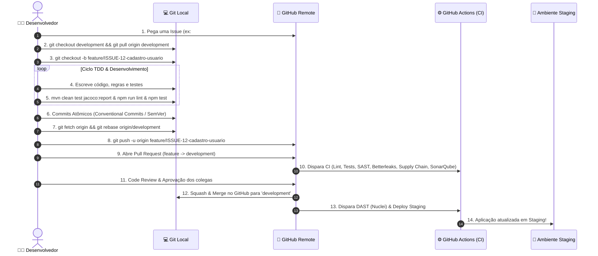
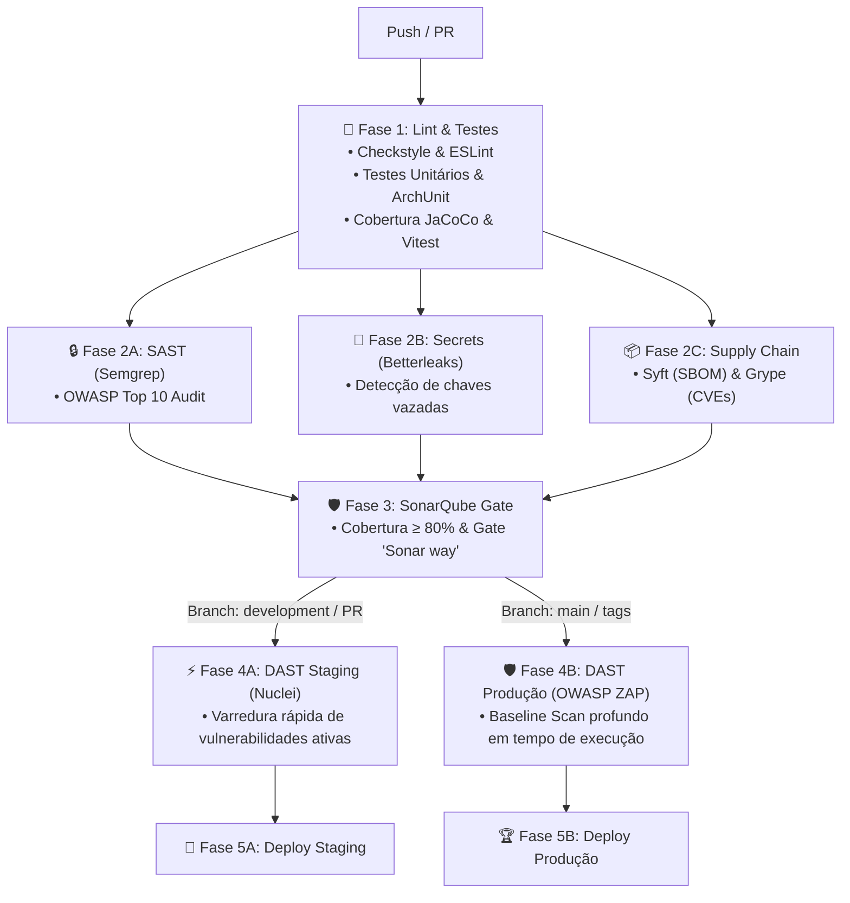

# 📖 Guia de Governança Git, Quality Gates & Segurança (DevSecOps)

> **Unidade de Extensão: Fullstack (SENAC 2026.2)**  
> **Docente:** Prof. Fábio Chicout  
> **Servidor SonarQube:** [https://sonar.fchicout.dev](https://sonar.fchicout.dev)  
> **Servidor LLDAP:** [https://lldap.fchicout.dev](https://lldap.fchicout.dev)

---

#### 📂 Estrutura do Repositório Gerado:

```text
fullstack-starter/
├── .github/
│   └── workflows/
│       └── ci-cd.yml                <-- Pipeline completo (Lint -> Tests -> SAST/Betterleaks/Syft/Grype -> SonarQube -> DAST Nuclei/ZAP -> Deploy)
├── backend/
│   ├── checkstyle.xml               <-- Regras de linting Java
│   ├── pom.xml                      <-- Java 21 LTS, Spring Boot 3.3, JaCoCo, ArchUnit, Checkstyle
│   └── src/
│       ├── main/java/br/senac/fullstack/
│       │   ├── FullstackApplication.java
│       │   ├── config/CorsConfig.java
│       │   ├── controller/HealthCheckController.java
│       │   ├── dto/HealthStatusDTO.java
│       │   └── service/HealthCheckService.java
│       └── test/java/br/senac/fullstack/
│           ├── FullstackApplicationTests.java
│           ├── controller/HealthCheckControllerTest.java
│           ├── service/HealthCheckServiceTest.java
│           └── architecture/ArchitectureRulesTest.java
├── frontend/
│   ├── eslint.config.mjs            <-- Regras de linting TypeScript / Angular
│   ├── package.json                 <-- Angular 22 (Zoneless, Signals), Vitest, ESLint
│   ├── angular.json                 <-- Configuração de build moderna (@angular/build)
│   ├── tsconfig.json
│   ├── vite.config.mts              <-- Configuração do runner moderno Vitest
│   └── src/app/
│       ├── app.component.ts         <-- Standalone + Signals + OnPush
│       ├── app.component.html       <-- Control Flow moderno (@if / @else)
│       ├── app.component.css
│       └── app.component.spec.ts    <-- Testes unitários com Vitest
├── pom.xml                          <-- Orquestrador Maven raiz + sonar-maven-plugin
├── README.md                        <-- Documentação de arquitetura e comandos de build
└── GITHUB_SETUP_GUIDE.md            <-- Este guia passo a passo
```

---

## 🏷️ Nomenclatura Padrão dos Repositórios no GitHub

Cada equipe deve criar e trabalhar **estritamente** com os seguintes nomes de repositório no GitHub:

* **Equipe DaMatch:** `senac-fullstack-damatch`
* **Equipe Azrael:** `senac-fullstack-azrael`

---

## 🌿 Política de Branches & Governança de Código Paralelo

Para permitir que vários desenvolvedores trabalhem simultaneamente sem conflitos, quebra de código ou vazamento de segredos, a equipe deve seguir rigorosamente a **Política de Branches Git**.

### 🎯 Regras Fundamentais:
1. **Branch `main` (Produção):** **100% Protegida.** Nenhum desenvolvedor tem permissão de fazer `push` direto ou abrir PRs individuais para a `main`. Apenas merges consolidados provenientes da `development` (ao fechar uma versão / release tag `vX.Y.Z`) entram na `main`.
2. **Branch `development` (Staging & Integração Contínua):** É a branch de trabalho base do time. Ninguém faz `push` direto na `development`. Todo código entra através de **Pull Requests (PR)** vindos de branches de feature/bugfix após aprovação dos Quality Gates e Code Review.
3. **Branches de Trabalho (`feature/*`, `bugfix/*`, `refactor/*`):** Ramificadas a partir da `development` mais recente.

---

## 🛣️ O Fluxo Feliz (Happy Path): Do Recebimento da Issue até o Deploy em Staging

Abaixo está o passo a passo exato que cada desenvolvedor deve executar do início ao fim de uma tarefa:



### 📋 Passo a Passo Detalhado do Fluxo:

#### Passo 1: Pegar a Issue e Atualizar o Ambiente Local
O desenvolvedor assume a responsabilidade de uma Issue no GitHub Projects / Kanban (ex: `Issue #12: Implementar autenticação`).
```bash
# 1. Troca para a branch development e garante sincronia com o repositório central
git checkout development
git pull origin development
```

#### Passo 2: Criar uma Branch com Nomenclatura Semântica
Crie a branch a partir da `development` usando a convenção de prefixos:
* Para novas funcionalidades: `feature/ISSUE-<id>-descricao-curta`
* Para correção de bugs: `bugfix/ISSUE-<id>-descricao-curta`
* Para melhorias internas: `refactor/ISSUE-<id>-descricao-curta`

```bash
git checkout -b feature/ISSUE-12-auth-jwt
```

#### Passo 3: Desenvolvimento & Validação Local (Shift-Left)
Desenvolva a funcionalidade acompanhada de seus testes unitários e de arquitetura. Antes de commitar, valide localmente todos os gates:
```bash
# Validar Linting e Testes no Backend
cd backend
mvn checkstyle:check
mvn clean test jacoco:report

# Validar Linting e Testes no Frontend
cd ../frontend
npm run lint
npm test
```

#### Passo 4: Commits Atômicos Respeitando Conventional Commits & SemVer
Faça commits pequenos e autossuficientes seguindo a convenção **Conventional Commits**:
* `feat(...)`: Adiciona nova funcionalidade &rarr; Incrementa **MINOR** no SemVer (`0.X.0`).
* `fix(...)`: Corrige um bug &rarr; Incrementa **PATCH** no SemVer (`0.0.X`).
* `refactor(...)`: Mudança interna sem alterar comportamento externo.
* `test(...)`: Adição ou ajuste de suítes de testes.
* `BREAKING CHANGE:` ou `feat!:` &rarr; Quebra de compatibilidade &rarr; Incrementa **MAJOR** (`X.0.0`).

```bash
git add .
git commit -m "feat(auth): add jwt token generation and user validation"
```

#### Passo 5: Sincronização Prévia com a Branch `development` (Rebase)
Evite commits de merge desnecessários e conflitos remotos rebaseando sua branch antes do push:
```bash
git fetch origin
git rebase origin/development
```

#### Passo 6: Push da Branch & Abertura do Pull Request (PR)
Envie a branch para o repositório remoto e abra um Pull Request apontando para a branch **`development`**:
```bash
git push -u origin feature/ISSUE-12-auth-jwt
```
1. No GitHub, abra o PR com o título claro (ex: `feat(auth): implement jwt token generation (#12)`).
2. O **GitHub Actions** dispara automaticamente a validação de:
   * 🔍 **Linting:** Checkstyle e ESLint.
   * 🧪 **Testes & Cobertura:** JUnit 5, JaCoCo, ArchUnit e Vitest.
   * 🔒 **SAST:** Semgrep (OWASP Top 10).
   * 🔑 **Secret Scanning:** Betterleaks (busca por tokens e credenciais vazadas).
   * 📦 **Supply Chain:** Syft (SBOM) e Grype (CVEs).
   * 🛡️ **Quality Gate:** SonarQube (`sonar.qualitygate.wait=true`).
3. Solicite a revisão de pelo menos 1 colega de equipe (Peer Review).

#### Passo 7: Merge para `development` & Deploy Automático em Staging
Com o PR aprovado pelos revisores e todos os checks verdes:
1. Realize o **Squash and Merge** no GitHub.
2. O GitHub Actions detecta o novo commit na `development`, executa o **DAST com Nuclei** e realiza o deploy no ambiente de **Staging**.
3. A branch remota da feature é excluída e a Issue é fechada.

---

## 🔒 Pilares DevSecOps no CI/CD ([`.github/workflows/ci-cd.yml`](.github/workflows/ci-cd.yml))



---

## ⚙️ Configuração dos Secrets no Repositório GitHub

Para que o pipeline do GitHub Actions consiga enviar os relatórios para o SonarQube e validar o Quality Gate, o líder da equipe deve cadastrar os seguintes segredos no repositório:

### 1. Provisionamento do Projeto no SonarQube (`sonar.fchicout.dev`)
1. Acesse [**https://sonar.fchicout.dev**](https://sonar.fchicout.dev) e efetue login com suas credenciais.
2. Clique em **Projects &rarr; Create Project &rarr; Manually**.
3. Defina o **Project display name** (ex: `Fullstack - Equipe DaMatch`) e o **Project key** (ex: `senac-fullstack-damatch`).
   *(Certifique-se de que o Project Key seja idêntico ao `<sonar.projectKey>` no `pom.xml` da raiz).*
4. Defina a **Main branch** como `main` e clique em **Set Up** &rarr; selecione **With GitHub Actions**.
5. Acesse **My Account &rarr; Security &rarr; Generate Tokens**, gere um token do tipo **Project Analysis Token** e copie o valor gerado.

### 2. Cadastro no GitHub Secrets
1. No repositório GitHub da equipe, acesse: **Settings &rarr; Secrets and variables &rarr; Actions**.
2. Clique em **New repository secret** e adicione:
   - **`SONAR_TOKEN`** *(Obrigatório)*: Token gerado no SonarQube.
   - **`SONAR_HOST_URL`** *(Opcional)*: `https://sonar.fchicout.dev`.
3. Em **Settings &rarr; Actions &rarr; General &rarr; Workflow permissions**, selecione **Read and write permissions** e salve.

---

## 🛡️ Regras de Proteção de Branches no GitHub (Branch Protection Rules)

Para garantir que o código só entre nas branches principais após aprovação do Quality Gate:

1. Acesse **Settings &rarr; Branches &rarr; Add branch protection rule**.
2. **Para a branch `development`:**
   - **Branch name pattern:** `development`
   - Marque: **Require a pull request before merging** (Require 1 approval).
   - Marque: **Require status checks to pass before merging**:
     - `🧪 Lint & Automated Tests`
     - `🛡️ SonarQube Quality Gate`
     - `🔒 SAST - Semgrep Security Audit`
     - `📦 Supply Chain - Syft (SBOM) & Grype (CVEs)`
   - Marque: **Require branches to be up to date before merging**.
3. **Para a branch `main`:**
   - **Branch name pattern:** `main`
   - Marque as mesmas travas e restrinja merges apenas a PRs vindos de `development` ou tags de release.

